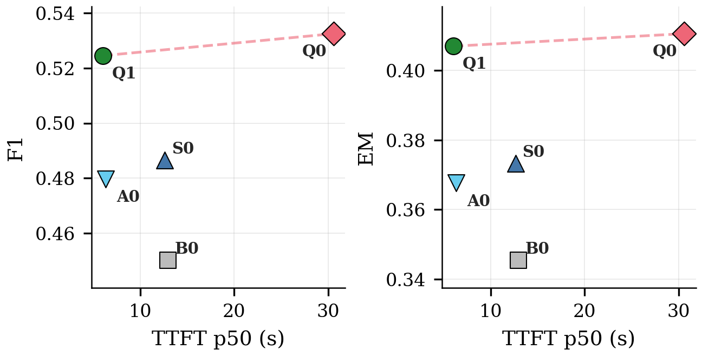
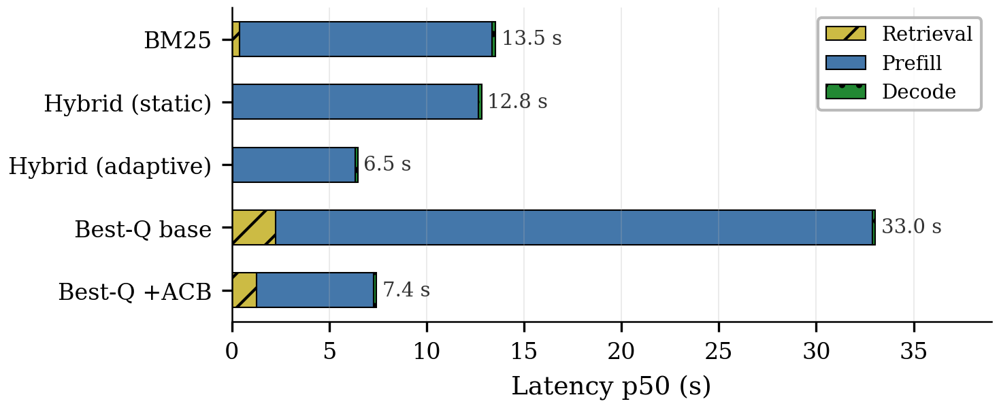

# CPU-Only RAG on Multi-Hop QA

This is a **code-focused, GitHub-ready** version of the project.
It keeps only the source code and the minimum runtime assets needed to execute the pipeline correctly, while excluding paper artifacts, experimental results, query pools, and large local assets.

## What is included

- `src/`: core Python packages
  - `rag_cpu/`: legacy CPU-only RAG stack
  - `agnostic_cpu_rag/`: agnostic controller and analysis components
- `scripts/`: executable entrypoints and research utilities
- `configs/`: minimal runnable config set
- `pyproject.toml`: packaging and dependencies
- placeholder directories for `models/`, `data/`, `cache/`, `logs/`, `results/`
- `.gitignore` tuned for a lightweight public repo

## What is intentionally excluded

- paper sources and the full figure/table package
- experimental results and raw benchmark outputs
- canonical query pools and subset files
- Windows delivery bundle
- local caches, datasets, logs, and model weights

This keeps the repository small and focused on the runnable codebase.

## How the system works

1. **Corpus preparation**
   - chunk documents into overlapping text spans
   - build a shared retrieval corpus

2. **Retrieval**
   - BM25 sparse retrieval
   - sentence-transformer dense retrieval
   - hybrid fusion when enabled
   - optional multi-hop query expansion in best-quality settings

3. **Context control**
   - baseline mode: use the final retrieval set directly
   - ACB variants: reduce context before generation
   - ACB-SC: self-calibrating controller driven by retrieval-side signals and adaptive runtime guardrails

4. **Generation**
   - `llama-cpp-python` + GGUF model
   - CPU-only inference

5. **Evaluation**
   - answer quality
   - retrieval quality
   - latency breakdowns
   - optional power profiling on macOS

## Repository layout

```text
.
├── src/
│   ├── rag_cpu/
│   └── agnostic_cpu_rag/
├── scripts/
├── configs/
│   ├── base.yaml
│   └── legacy_acbsc_eval/hotpot_agnostic_acb_sc_full7405_p4.yaml
├── models/
├── data/
├── cache/
├── logs/
├── results/generated/
├── pyproject.toml
└── README.md
```

## Representative plots

These two plots summarize the main quality/latency behavior of the final systems.

### EM/F1 vs TTFT p50



### Latency breakdown



## Setup

```bash
python3.11 -m venv .venv
source .venv/bin/activate
pip install -U pip setuptools wheel
pip install -e .
```

## Required external asset

Place the GGUF model here:

```text
models/qwen2.5-3b-instruct-q4_k_m.gguf
```

Datasets are not bundled and are downloaded on first use.

## Quick run

### Standard benchmark run

```bash
PYTHONPATH=src .venv/bin/python scripts/benchmark_suite.py \
  --config configs/base.yaml \
  --dataset hotpot_qa \
  --tier A \
  --num-queries 20 \
  --run-id smoke_hotpot
```

### ACB-SC example run

```bash
PYTHONPATH=src .venv/bin/python scripts/benchmark_suite.py \
  --config configs/legacy_acbsc_eval/hotpot_agnostic_acb_sc_full7405_p4.yaml \
  --dataset hotpot_qa \
  --num-queries 20 \
  --run-id smoke_hotpot_acbsc
```

### Optional power profiling on macOS

```bash
sudo env PYTHONPATH=src .venv/bin/python scripts/benchmark_suite.py ... --profile-power --power-sampling-interval-ms 1000
```

## Notes

- Outputs are written under `results/`.
- `scripts/` still contains some research utilities that assume larger experimental assets; the core runnable entrypoint is `scripts/benchmark_suite.py`.
- The bundled configs are intentionally minimal. Add your own configs if you want to recreate the full experimental campaign.
